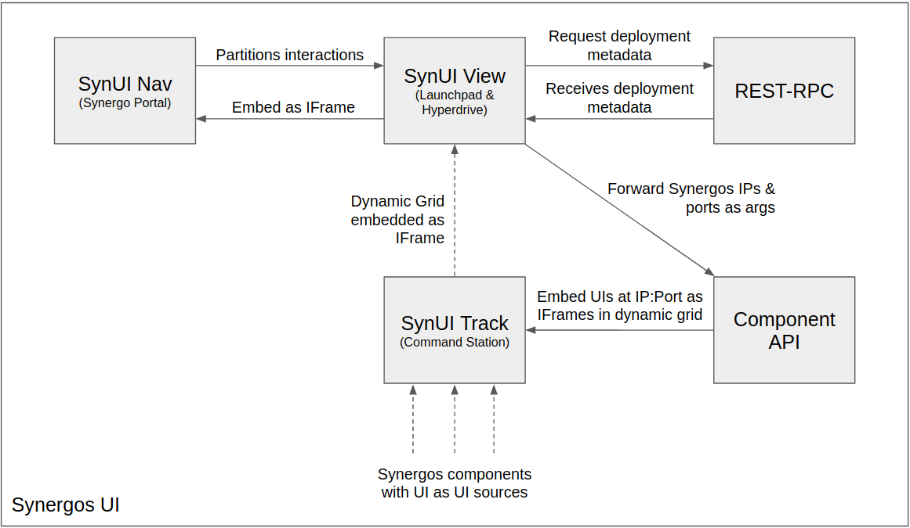

# Synergos UI

Unified UI component of a Synergos network

<br>


Synergos Portal sits atop ANY deployed `Synergos` configurations.

It interacts with Synergos REST services embedded within any orchestrating components (i.e. [Synergos Director](https://github.com/aimakerspace/synergos_director) and [Synergos TTP](https://github.com/aimakerspace/synergos_ttp)). The goal is to further simplify & consolidate the 3 stages of a federated cycle into intuitive UI maps. 



Furthermore, the general architecture of the system is flexible incorporate new external frameworks. 

---
<br>

## Installation

```
# Download source repository
git clone https://github.com/aimakerspace/synergos_ui
cd ./synergos_ui

# Checkout to stable tag
git checkout tags/v0.1.0

# Initialize & update all submodules
git submodule update --init --recursive
git submodule update --recursive --remote

# Start containerized services
docker-compose up
```

Once all services are up, navigate to `"<protocol>://<address>:<port>"`
- `<protocol>`: Whether connection has been secured (i.e. `http`/`https`)
- `<address>`: Address of host machine
- `<port>`: Port at which `synui_nav` is hosted at (default: `4000`)

You should come to this landing page.


---
<br>

## Navigating Synergos Portal

All 3 stages of a federated cycle (i.e. *Registration*, *Training* and *Evaluation*) are initializable from Synergos Portal


*Orchestrator Interactions*

Orchestrators will interact with all paths supported on the `Orchestrator` tab, and is independent from that of participants' interactions.

Orchestrators will be able to:
- Manage collaboration metadata
- Manage project metadata
- Manage experiment metadata
- Manage run metadata
- Submit training cycles
- Submit optimization cycles


*Participant Interactions*

Participants will interact with all paths supported on the `Participant` tab, and is independent from that of participants' interactions.

Participants will be able to:
- Manage their profiles
- Manage their project registrations
- Submit inference requests


*Command Station*

Lastly, all components deployed can be tracked within the `Command Station`!